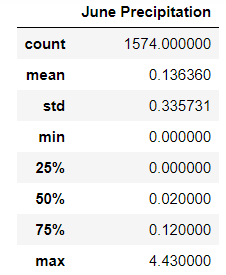
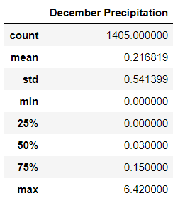

# Surfs_Up

## Challenge
---
### Purpose
  - The purpose of the challenge was to compare precipitation statistics for the month of June to those for the month of December to determine whether the seasons could affect the surf and ice cream shop business.  
---
### Results
  - Below are the results of the queries across all stations and all years:

 

  - The differences in count can be attributed to the fact that we do not have December 2017 data across all stations where we do for June 2017.
  - The mean, or average, rain fall for the month of June is 0.136 inches versus 0.217 for the month of December.  With the additional average rain fall in the winter, it could be anticipated that sales could be down in the wetter season.
  - The standard deviation of both months is 2.5 times greater than the mean illustrating that the data is accurately comparable.
  - With the quartiles also being similar, it can be determined that there are not necessarily more rainy days in December versus June, but rather when it does rain, it rains more in December that in June.  This finding could suggest that perhaps sales would not be affected by the rain due to a similar number of rainy days.  
---
### Suggestions
  - It is suggested that:
      1.  All months be analyzed to determine if Spring and Fall have more or less rain.
      2.  The number of rainy days be analyzed.  If there is light rain all day for a week that equates to 3 inches, but keeps customers indoors, that could be more detrimental than one day of rain that equates to 3 inches of heavy rain.     
      3.  The duration of rain from a time standpoint should be analyzed. Do storms last 15 mins or 8 hours?  How many days are complete washouts versus days where there are quick, intermittent storms.
---
