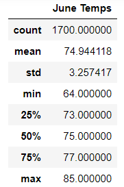
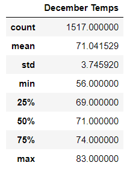

# Surfs_Up

## Challenge
---
### Purpose
  - The purpose of the challenge was to compare temperature statistics for the month of June to those for the month of December to determine whether the seasons could affect the surf and ice cream shop business.  
---
### Results
  - Below are the results of the queries across all stations and all years:

 

  - The differences in count can be attributed to the fact that we do not have December 2017 data across all stations where we do for June 2017.
  - The mean, or average, temperature for the month of June is 75 degrees versus 71 for the month of December.  With the lower average temperature in the winter, it could be anticipated that sales could be down in the cooler season.
  - The standard deviation of both months is 2.5 times greater than the mean illustrating that the data is accurately comparable.
---
### Suggestions
  - It is suggested that:
      1.  All months be analyzed to determine if Winter, Spring, Summer, and Fall have higher or lower temperatures on a broader scale.
      2.  The number of rainy days be analyzed.  If there is a wet season, it would be beneficial to know how long it lasts and at what time one should anticipate it.     
      3.  The duration of rain from a time standpoint should be analyzed. Do storms in Hawaii last 15 mins or 8 hours?  How many days are complete washouts versus days where there are quick, intermittent storms.
---
